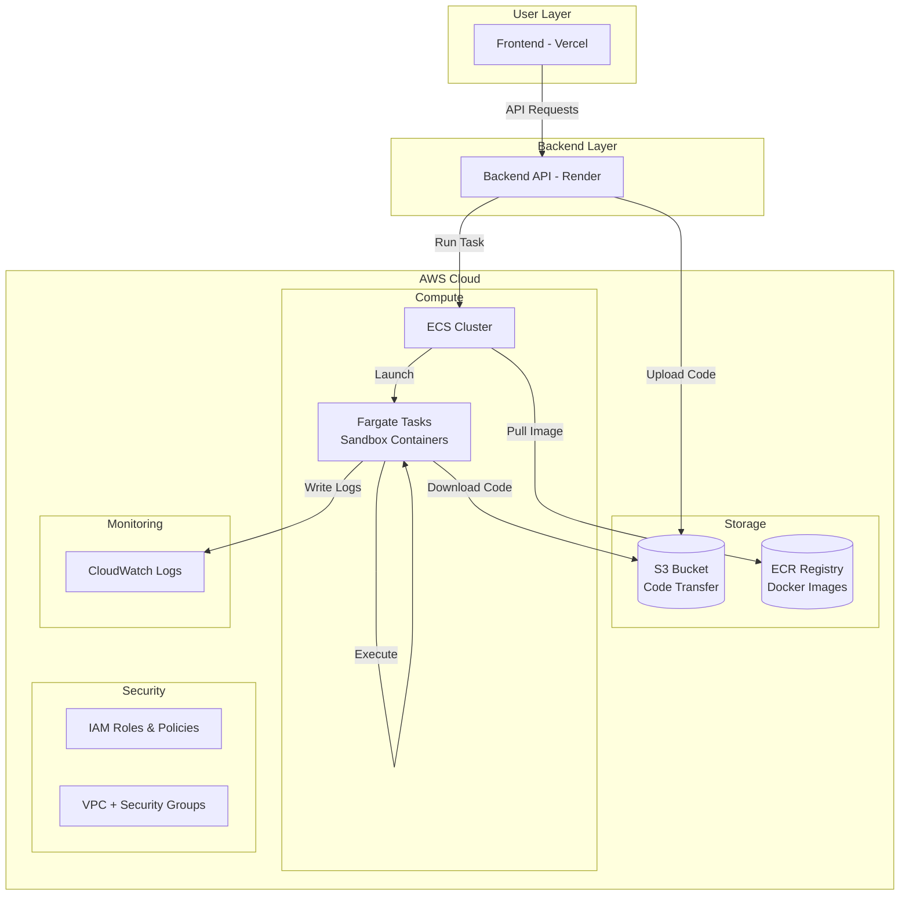
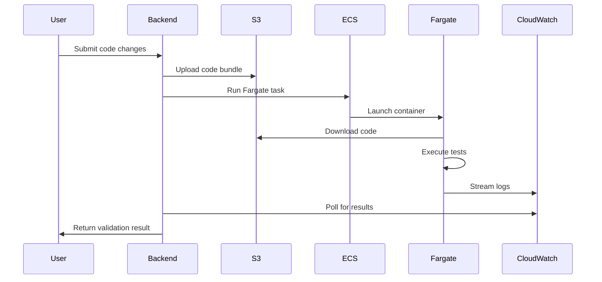
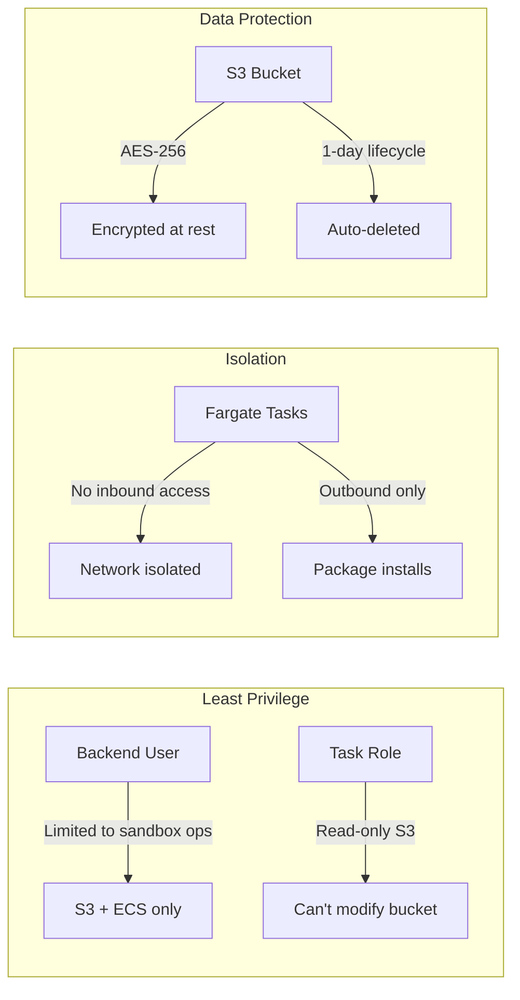

# NotSudo AWS Infrastructure Architecture

> Complete overview of the AWS infrastructure for running secure code validation sandboxes.

---

## High-Level Architecture



---

## AWS Services Overview

| Service | Purpose | Why We Use It |
|---------|---------|---------------|
| **ECR** | Docker image registry | Store our sandbox container images securely |
| **ECS Fargate** | Serverless containers | Run isolated code execution without managing servers |
| **S3** | Object storage | Transfer code files between backend and containers |
| **CloudWatch** | Logging & monitoring | Capture execution logs and debug issues |
| **IAM** | Access management | Secure permissions using least-privilege principle |
| **VPC** | Network isolation | Control container network access |

---

## System Components & Roles

### Client Layer

| Component | Technology | Role |
|-----------|------------|------|
| **Frontend** | Next.js on Vercel | User interface for submitting GitHub issues, viewing AI analysis, and triggering code validation |

**Responsibilities**:
- Present issue details and AI-suggested fixes to users
- Send API requests to backend for code validation
- Display execution results (pass/fail/logs)
- Manage user authentication and GitHub OAuth

---

### Server Layer

| Component | Technology | Role |
|-----------|------------|------|
| **Backend API** | FastAPI on Render | Orchestrates all business logic, AI calls, and AWS sandbox execution |

**Responsibilities**:
- Receive webhook events from GitHub (issues, PRs)
- Call AI services (Gemini) for code analysis and fixes
- Package code changes and upload to S3
- Trigger ECS Fargate tasks for sandbox execution
- Poll CloudWatch for execution results
- Create GitHub PRs with validated fixes
- Manage environment configuration and secrets

---

### AWS Service Roles

#### Storage Services

| Service | Role | Interaction |
|---------|------|-------------|
| **S3 Bucket** | **Code Transfer Hub** | Backend uploads code → Container downloads code |

| **ECR Registry** | **Image Storage** | Stores Docker images → ECS pulls images at runtime |
**S3 Bucket Details**:
- Acts as intermediary since Fargate can't receive files directly
- Holds code bundles temporarily (auto-deleted after 1 day)
- Encrypted at rest for security

**ECR Details**:
- Private Docker registry within AWS account
- Stores `sandbox-python` and `sandbox-node` images
- Fast image pulls since it's in the same region as ECS

---

#### Compute Services

| Service | Role | Interaction |
|---------|------|-------------|
| **ECS Cluster** | **Task Orchestrator** | Receives RunTask calls → Schedules Fargate tasks |
| **Fargate Tasks** | **Sandbox Executor** | Runs isolated containers → Executes user code safely |

**ECS Cluster Details**:
- Logical grouping for all sandbox tasks
- Uses FARGATE capacity provider (serverless)
- Manages task scheduling and lifecycle

**Fargate Task Details**:
- Ephemeral containers (spin up → execute → terminate)
- Isolated execution environment per job
- No persistent state between runs
- Resource-limited (0.25 vCPU, 512 MB RAM)

---

#### Monitoring Services

| Service | Role | Interaction |
|---------|------|-------------|
| **CloudWatch Logs** | **Log Aggregator** | Containers stream logs → Backend retrieves logs |

**CloudWatch Details**:
- Centralized log storage for all container output
- Log group: `/ecs/sandbox`
- Each task creates unique log stream
- Backend polls for stdout/stderr to determine success/failure
- 7-day retention to control costs

---

#### Security Services

| Service | Role | Interaction |
|---------|------|-------------|
| **IAM Roles** | **Permission Manager** | Controls what each component can access |
| **VPC/Security Groups** | **Network Guard** | Controls network traffic in/out of containers |

**IAM Roles**:

| Role/User | Who Uses It | What It Can Do |
|-----------|-------------|----------------|
| `sandbox-task-role` | Fargate containers | Read from S3, write to CloudWatch |
| `notsudo-backend` (user) | Render backend | Upload to S3, run ECS tasks, read logs |

**VPC/Security Group**:
- Containers run in default VPC public subnets
- Security group `sandbox-sg`:
  - ✅ **Outbound**: All traffic allowed (for `pip`/`npm` installs)
  - ❌ **Inbound**: No traffic allowed (isolation)

---

## Execution Flow



### Step-by-Step Breakdown

#### Step 1: User Submits Code Changes
- User triggers code validation through the NotSudo frontend (e.g., creating a PR or testing fixes)
- The frontend sends an API request to the Render-hosted backend with the proposed code changes

#### Step 2: Backend Uploads Code to S3
- Backend packages the code changes into a ZIP/tarball bundle
- Bundle is uploaded to S3 bucket: `s3://notsudo-sandbox-code-<account-id>/jobs/<job-id>/`
- S3 encrypts the file at rest using AES-256
- **Why S3?** Fargate containers can't receive files directly—S3 acts as the transfer layer

#### Step 3: Backend Triggers ECS Task
- Backend calls `ecs:RunTask` API with:
  - Cluster: `sandbox-cluster`
  - Task definition: `sandbox-task`
  - Network config: Subnets + Security Group
  - Environment variables: Job ID, S3 path
- ECS schedules the task on Fargate capacity

#### Step 4: Fargate Launches Container
- ECS pulls the Docker image from ECR (`sandbox-python:latest` or `sandbox-node:latest`)
- Container starts in an isolated VPC with only outbound internet access
- Container receives the job configuration via environment variables
- **Resources**: 0.25 vCPU, 512 MB RAM (configurable)

#### Step 5: Container Downloads Code from S3
- Container uses the `sandbox-task-role` IAM role to authenticate
- Downloads the code bundle from S3 using `s3:GetObject`
- Extracts the bundle into the container's working directory

#### Step 6: Container Executes Tests
- Detects project type (Python/Node.js) from files
- Installs dependencies (outbound internet allowed for `pip`/`npm`)
- Runs validation commands:
  - Python: `pip install -r requirements.txt && pytest`
  - Node: `npm install && npm test`
- Captures stdout/stderr and exit code

#### Step 7: Container Streams Logs to CloudWatch
- All output is automatically streamed using the `awslogs` driver
- Logs go to: `/ecs/sandbox` log group
- Each task gets a unique log stream: `sandbox/<container>/<task-id>`

#### Step 8: Backend Polls CloudWatch for Results
- Backend periodically calls `logs:GetLogEvents` to fetch output
- Also calls `ecs:DescribeTasks` to check task status (RUNNING/STOPPED)
- Waits for task to complete or timeout (configurable, default 5 minutes)

#### Step 9: Backend Returns Result to User
- Parses the execution logs for success/failure
- Returns structured result to frontend:
  - ✅ **Success**: All tests passed
  - ❌ **Failure**: Test output + error messages
  - ⏱️ **Timeout**: Task exceeded time limit
- S3 code bundle auto-deleted after 1 day (lifecycle policy)

---

## Service Details & Commands

### 1. AWS CLI Configuration

```bash
aws configure
```

| Setting | Value | Reason |
|---------|-------|--------|
| Access Key ID | From IAM User | Authentication credential |
| Secret Access Key | From IAM User | Authentication secret |
| Region | `us-east-1` | Primary region with best pricing |
| Output | `json` | Machine-readable format for scripting |

> [!NOTE]
> We created a dedicated IAM user `notsudo-admin` for setup to avoid using root credentials.

---

### 2. ECR (Elastic Container Registry)

**What it does**: Private Docker registry to store our sandbox images securely.

**Commands executed**:

```bash
# Create Python sandbox repository
aws ecr create-repository --repository-name sandbox-python --region us-east-1

# Create Node.js sandbox repository  
aws ecr create-repository --repository-name sandbox-node --region us-east-1
```

**Why ECR?**
- ✅ **Security**: Private registry with IAM integration
- ✅ **Speed**: Images stored in same region as ECS = fast pulls
- ✅ **Cost**: $0.10/GB/month, first 500MB free
- ✅ **Integration**: Native ECS support, no auth complexity

**Image Push Flow**:

```bash
# Authenticate Docker with ECR
aws ecr get-login-password | docker login --username AWS --password-stdin <registry>

# Build, tag, and push
docker build -f python.Dockerfile -t sandbox-python:latest .
docker tag sandbox-python:latest <account>.dkr.ecr.us-east-1.amazonaws.com/sandbox-python:latest
docker push <account>.dkr.ecr.us-east-1.amazonaws.com/sandbox-python:latest
```

---

### 3. S3 (Simple Storage Service)

**What it does**: Temporary storage for code transfer between backend and sandbox containers.

**Commands executed**:

```bash
# Create bucket with unique name
aws s3 mb s3://notsudo-sandbox-code-<account-id>

# Enable server-side encryption
aws s3api put-bucket-encryption \
    --bucket notsudo-sandbox-code-<account-id> \
    --server-side-encryption-configuration '{
        "Rules": [{"ApplyServerSideEncryptionByDefault": {"SSEAlgorithm": "AES256"}}]
    }'

# Auto-delete files after 1 day
aws s3api put-bucket-lifecycle-configuration \
    --bucket notsudo-sandbox-code-<account-id> \
    --lifecycle-configuration '{
        "Rules": [{
            "ID": "DeleteOldCode",
            "Status": "Enabled",
            "Expiration": {"Days": 1},
            "Filter": {"Prefix": "jobs/"}
        }]
    }'
```

**Why S3?**

| Feature | Benefit |
|---------|---------|
| Encryption (AES-256) | Code is encrypted at rest |
| Lifecycle policies | Auto-cleanup = no storage bloat |
| IAM integration | Fine-grained access control |
| Durability (99.999999999%) | Files won't be lost |

> [!IMPORTANT]
> Bucket names must be globally unique. We append the account ID to ensure uniqueness.

---

### 4. IAM (Identity and Access Management)

**What it does**: Controls who/what can access AWS resources.

#### 4.1 ECS Task Role (`sandbox-task-role`)

**Purpose**: Permissions for the Fargate containers themselves.

```bash
# Create role with ECS trust policy
aws iam create-role \
    --role-name sandbox-task-role \
    --assume-role-policy-document '{
        "Version": "2012-10-17",
        "Statement": [{
            "Effect": "Allow",
            "Principal": {"Service": "ecs-tasks.amazonaws.com"},
            "Action": "sts:AssumeRole"
        }]
    }'

# Attach custom policy for S3 + CloudWatch access
aws iam put-role-policy \
    --role-name sandbox-task-role \
    --policy-name sandbox-s3-logs \
    --policy-document '{...}'

# Attach AWS managed policy for ECS task execution
aws iam attach-role-policy \
    --role-name sandbox-task-role \
    --policy-arn arn:aws:iam::aws:policy/service-role/AmazonECSTaskExecutionRolePolicy
```

**Permissions granted to containers**:

| Permission | Resource | Reason |
|------------|----------|--------|
| `s3:GetObject` | Sandbox bucket | Download code to execute |
| `s3:ListBucket` | Sandbox bucket | List available files |
| `logs:CreateLogStream` | /ecs/sandbox | Create log streams |
| `logs:PutLogEvents` | /ecs/sandbox | Write execution logs |

#### 4.2 Backend User (`notsudo-backend`)

**Purpose**: Credentials for the Render backend to interact with AWS.

```bash
# Create dedicated user
aws iam create-user --user-name notsudo-backend

# Attach minimal permissions policy
aws iam put-user-policy \
    --user-name notsudo-backend \
    --policy-name backend-sandbox-access \
    --policy-document '{...}'

# Generate access keys for Render
aws iam create-access-key --user-name notsudo-backend
```

**Permissions granted to backend**:

| Permission | Reason |
|------------|--------|
| `s3:PutObject` | Upload code bundles |
| `s3:DeleteObject` | Cleanup after execution |
| `ecs:RunTask` | Start sandbox containers |
| `ecs:DescribeTasks` | Monitor task status |
| `ecs:StopTask` | Terminate runaway tasks |
| `iam:PassRole` | Assign task role to containers |
| `logs:GetLogEvents` | Retrieve execution output |

> [!CAUTION]
> The access keys from `create-access-key` are shown only once. Save them immediately!

---

### 5. ECS Cluster

**What it does**: Logical grouping for running container tasks.

```bash
aws ecs create-cluster \
    --cluster-name sandbox-cluster \
    --capacity-providers FARGATE \
    --default-capacity-provider-strategy capacityProvider=FARGATE,weight=1
```

**Why Fargate?**

| EC2 (Traditional) | Fargate (Serverless) |
|-------------------|----------------------|
| Manage instances yourself | No servers to manage |
| Pay for always-on capacity | Pay only when running |
| Complex scaling | Automatic scaling |
| Security patches required | AWS handles patches |

> We use Fargate because sandbox tasks are sporadic—no need to pay for idle servers.

---

### 6. CloudWatch Logs

**What it does**: Centralized log storage for container output.

```bash
# Create log group
aws logs create-log-group --log-group-name /ecs/sandbox

# Set 7-day retention (cost optimization)
aws logs put-retention-policy \
    --log-group-name /ecs/sandbox \
    --retention-in-days 7
```

**Why CloudWatch?**

- ✅ Native Fargate integration (log driver built-in)
- ✅ Searchable logs for debugging
- ✅ Retention policies prevent storage bloat
- ✅ Backend can poll logs via API

---

### 7. VPC & Security Groups

**What it does**: Network isolation and access control.

```bash
# Get default VPC
VPC_ID=$(aws ec2 describe-vpcs --filters "Name=isDefault,Values=true" --query "Vpcs[0].VpcId" --output text)

# Get public subnets
SUBNET_IDS=$(aws ec2 describe-subnets --filters "Name=vpc-id,Values=$VPC_ID" --query "Subnets[?MapPublicIpOnLaunch].SubnetId" --output text)

# Create security group
aws ec2 create-security-group \
    --group-name sandbox-sg \
    --description "Security group for sandbox tasks" \
    --vpc-id $VPC_ID

# Allow outbound internet (for pip/npm install)
aws ec2 authorize-security-group-egress \
    --group-id $SG_ID \
    --protocol all \
    --cidr 0.0.0.0/0
```

**Security considerations**:

| Rule | Direction | Purpose |
|------|-----------|---------|
| All traffic to 0.0.0.0/0 | **Outbound** | Allow package downloads |
| No inbound rules | **Inbound** | No external access to containers |

> [!NOTE]
> Containers can reach the internet (for `pip install`, `npm install`) but nothing can reach them.

---

### 8. ECS Task Definition

**What it does**: Blueprint for running containers—specifies image, resources, and configuration.

```bash
aws ecs register-task-definition --cli-input-json '{
    "family": "sandbox-task",
    "networkMode": "awsvpc",
    "requiresCompatibilities": ["FARGATE"],
    "cpu": "256",
    "memory": "512",
    "executionRoleArn": "<role-arn>",
    "taskRoleArn": "<role-arn>",
    "containerDefinitions": [{
        "name": "sandbox",
        "image": "<account>.dkr.ecr.us-east-1.amazonaws.com/sandbox-python:latest",
        "essential": true,
        "logConfiguration": {
            "logDriver": "awslogs",
            "options": {
                "awslogs-group": "/ecs/sandbox",
                "awslogs-region": "us-east-1",
                "awslogs-stream-prefix": "sandbox"
            }
        }
    }]
}'
```

**Resource allocation**:

| Setting | Value | Reason |
|---------|-------|--------|
| CPU | 256 (0.25 vCPU) | Minimal compute for code tests |
| Memory | 512 MB | Sufficient for most scripts |
| Network | awsvpc | Required for Fargate |

> Tasks automatically download the image from ECR and send logs to CloudWatch.

---

## Environment Variables for Backend

These are set in Render after AWS setup:

| Variable | Value | Purpose |
|----------|-------|---------|
| `USE_AWS_SANDBOX` | `true` | Enable AWS sandbox mode |
| `AWS_ACCESS_KEY_ID` | From IAM user | Backend authentication |
| `AWS_SECRET_ACCESS_KEY` | From IAM user | Backend authentication |
| `AWS_REGION` | `us-east-1` | Target region |
| `AWS_ECS_CLUSTER` | `sandbox-cluster` | Cluster to run tasks |
| `AWS_ECS_TASK_DEFINITION` | `sandbox-task` | Task definition name |
| `AWS_S3_BUCKET` | `notsudo-sandbox-code-<account>` | Code transfer bucket |
| `AWS_ECR_REGISTRY` | `<account>.dkr.ecr.us-east-1.amazonaws.com` | Image registry |
| `AWS_SUBNETS` | Comma-separated IDs | Network subnets |
| `AWS_SECURITY_GROUPS` | Security group ID | Network security |
| `AWS_LOG_GROUP` | `/ecs/sandbox` | Log destination |

---

## Cost Breakdown

| Resource | Usage | Monthly Cost |
|----------|-------|--------------|
| ECR Storage | ~500 MB images | **$0.05** |
| S3 Storage | ~100 MB temporary | **$0.002** |
| CloudWatch Logs | ~1 GB/month | **$0.50** |
| Fargate Tasks | 50 runs × 2 min × 0.25 vCPU | **~$3.00** |
| **Total** | | **~$4/month** |

> [!TIP]
> Costs scale with usage. For 100 daily executions, expect ~$15/month.

---

## Security Summary



**Key security measures**:

1. **Least privilege IAM**: Backend can only do sandbox operations
2. **Network isolation**: No inbound traffic to containers
3. **Encryption**: All S3 data encrypted at rest
4. **Auto-cleanup**: Code deleted after 1 day
5. **Log retention**: Logs deleted after 7 days
6. **Serverless**: No persistent servers to patch/maintain

---

## Cleanup Commands

To remove all AWS resources:

```bash
# Delete in reverse order of creation
aws ecs delete-cluster --cluster sandbox-cluster
aws ecr delete-repository --repository-name sandbox-python --force
aws ecr delete-repository --repository-name sandbox-node --force
aws s3 rb s3://notsudo-sandbox-code-<account-id> --force
aws iam delete-user-policy --user-name notsudo-backend --policy-name backend-sandbox-access
aws iam delete-access-key --user-name notsudo-backend --access-key-id <key-id>
aws iam delete-user --user-name notsudo-backend
aws iam delete-role-policy --role-name sandbox-task-role --policy-name sandbox-s3-logs
aws iam detach-role-policy --role-name sandbox-task-role --policy-arn arn:aws:iam::aws:policy/service-role/AmazonECSTaskExecutionRolePolicy
aws iam delete-role --role-name sandbox-task-role
aws logs delete-log-group --log-group-name /ecs/sandbox
```

---

## Quick Reference

| Task | Command |
|------|---------|
| Check cluster status | `aws ecs describe-clusters --clusters sandbox-cluster` |
| List ECR images | `aws ecr describe-repositories` |
| View running tasks | `aws ecs list-tasks --cluster sandbox-cluster` |
| Read container logs | `aws logs tail /ecs/sandbox --follow` |
| Check S3 bucket | `aws s3 ls s3://notsudo-sandbox-code-<account>/` |
